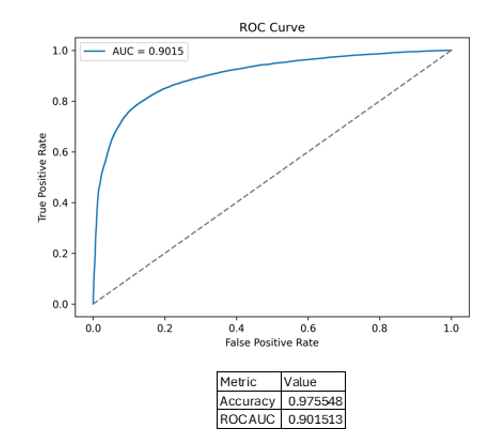
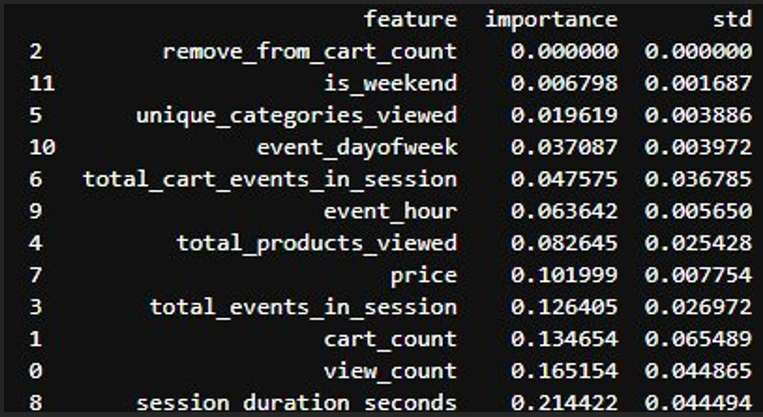
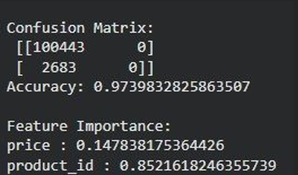
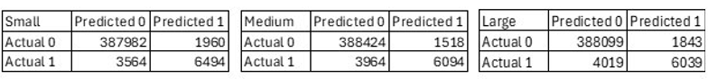

# Predicting-Purchasing-Behavior-Project

## Project Overview
In this project, I worked with a team to predict a customer purchase behavior. This was done using transactional and web session data from an online store. We then compared performance across multiple models to determine the most efficient approach.

## Key Objectives
1. **Predict Purchase Likelihood:** Build machine learning models to forecast whether a session ends in a purchase ($1 = \text{Yes}, 0 = \text{No}$).
2. **Identify Behavioral Drivers:** Determine which customer actions (e.g., cart adds, total events, view counts) most strongly indicate intent to buy.
3. **Model Optimization:** Compare performance across multiple algorithms (linear baselines, tree-based models, and neural networks) to balance accuracy and computational efficiency for targeted marketing.

## Dataset
- <a href="https://github.com/thowardIV/Predicting-Purchasing-Behavior-Project/blob/main/ecommerce_sample.zip">Dataset</a>

## Preprocessing
  * Group by product and session
  * Removed missing values
  * $60 / 40$ train-test split

# Key Predictors
`price`, `view_count`, `cart_count`, `session_duration_seconds`, `total_events_in_session`, `unique_categories_viewed`, `event_hour`, `is_weekend`

## Models & Performance Summary

We evaluated six different modeling approaches:

| Model | Accuracy | Insights & Findings |
| :--- | :---: | :--- |
| **Linear Regression** | $R^2 = 0.0043$ | Statistically significant ($p < 0.0001$), but fails to capture non-linear relationships. Serves as a baseline. |
| **Decision Tree** | ~97.4% | **Misleading:** High accuracy because the model failed to identify any actual buyers; predicted `0` (No Purchase) for all instances. |
| **Logistic Regression** | 97.5% | Strong performance ($\text{ROC AUC} = 0.9015$). Reveals that long sessions with high product views ("endless browsing" / doom scrolling) negatively correlate with purchase probability ($\beta = -4.6$). |
| **Random Forest** | High | Resolved variance issue of single trees. Top predictors: `session_duration_seconds` ($21.4\%$), `view_count` ($16.5\%$), and `cart_count` ($13.5\%$). |
| **Small Neural Net** | **98.62%** | **Best performance/efficiency trade-off** (Execution time: ~89s). |
| **Medium Neural Net**| 98.63% | Similar accuracy to Small NN, but execution time doubled (~194s). |
| **Large Neural Net** | 98.53% | Accuracy slightly dropped due to overfitting and added noise (~500s runtime). |

---

## Visual Insights

### 1. Model Diagnostics & Feature Importance

| Logistic Regression ROC Curve | Feature Importance Breakdown |
| :---: | :---: |
|  |  |
| *Strong model capability with an AUC of 0.9015.* | *Session duration, view counts, and cart counts dominate predictive power.* |

---

### 2. Confusion Matrices Comparison

  
  

  <em><b>Left:</b> Decision Tree predicting all zeros due to class imbalance. <b>Right:</b> Neural Network accurately classifying buyers vs non-buyers.</em>

---

## Key Insights & Business Recommendations

1. **Browsing vs. Buying Signals:**  
   * High `cart_count` and `total_events_in_session` strongly signal high intent to buy.
   * Excessive `total_products_viewed` paired with long duration often signals customer hesitation or lost browsing ("endless browsing"), which correlates negatively with purchase completion.
2. **Model Selection:**  
   * Complex models outperformed the linear baselines.
   * The **Small Neural Network** yielded the best balance of predictive power ($98.62\%$ accuracy) and training efficiency (~89s execution time). Adding excess complexity (Large NN) led to overfitting without improving accuracy.
3. **Actionable Marketing Tactics:**  
   * **Triggered Interventions:** Target high-event/high-cart session users with instant checkout nudges or exit-intent offers.
   * **Re-engagement:** Detect users trapped in "endless browsing" (high product views, low cart additions) and show recommended products or simplified category filters to guide decision-making.

---
